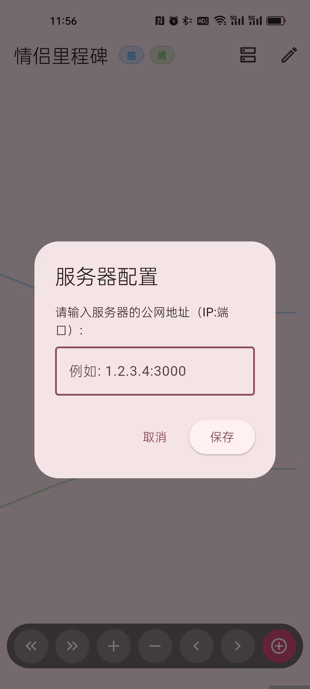

# milestones

情侣里程碑 Flutter 应用。

帮助情侣双方在发展自己事业、工作的同时，记录共同的可以留恋的事情。

展示事业和爱情的比重，实现两者在生活中的平衡。

## 介绍

情侣（夫妻）双方可以记录自己以及共同的里程碑事件，并以时间轴为横轴进行浏览。
- 双时间轴（两个人）
- 节点支持文字与图片集
- 两种节点类型：单人节点、共同节点


## 运行

包括客户端下载和后端服务器部署两部分：

1. 部署后端服务
    将backend文件放入服务器中

    ```shell
    cd backend
    npm install
    npm start
    ```
    注意打开服务器的3000端口。
2. 下载最新的release .apk
    
    输入服务器的公网ip以及端口，如下：
    
